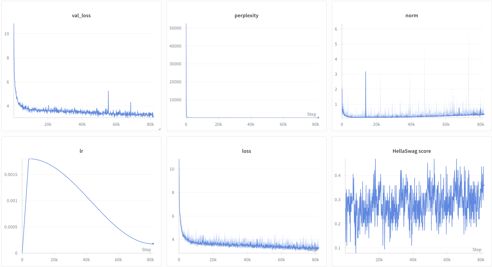

# 🚀 GPT-2.5 — A Modern Reproduction of GPT-2 (124M)

A **from-scratch implementation** of GPT-2 124M with modern architectural improvements found in state-of-the-art LLMs like LLaMA and Gemma.

[](https://huggingface.co/itskoma)

---

## ✨ Highlights

*   **Built from the ground up**: Every component—`Linear`, `Embedding`, `Softmax`—was implemented manually. Only `torch.nn.Parameter`, container classes (`Module`, `Sequential`), and `torch.optim.Optimizer` base class were used.
*   **Custom BPE Tokenizer**: Trained a Byte Pair Encoding tokenizer from scratch.
*   **Distributed Training**: Wrapped with FSDP for efficient multi-GPU training.
*   **Flash Attention**: Leverages `torch.nn.functional.scaled_dot_product_attention` for optimized attention.

---

## 🔧 Modern Architectural Changes

This reproduction incorporates key improvements over the original GPT-2:

| Feature             | Original GPT-2       | GPT-2.5 (This Repo)           |
| :------------------ | :------------------- | :---------------------------- |
| **Normalization**   | LayerNorm (Post)     | **RMSNorm (Pre)**             |
| **Activation**      | GELU                 | **SwiGLU**                    |
| **Positional Enc.** | Absolute             | **RoPE**                      |
| **Attention**       | Standard             | **Flash Attention**           |
| **Optimizer**       | Adam                 | **AdamW**                     |
| **Bias in Linears** | Yes                  | **No**                        |
| **Dataset**         | WebText              | **FineWeb 10B**               |

---

## ⚙️ Hyperparameters

| Parameter               | Value       |
| :---------------------- | :---------- |
| `batch_size`            | 32          |
| `grad_accum_steps`      | 2           |
| `tokens_per_step`       | 524,288     |
| `total_tokens_processed`| ~42B        |
| `training_steps`        | 80,000      |
| `context_length`        | 1024        |
| `num_layers`            | 12          |
| `num_heads`             | 12          |
| `d_model`               | 768         |
| `d_ff`                  | 2048        |
| `max_lr`                | 18e-4       |
| `weight_decay`          | 0.1         |
| `optimizer_betas`       | (0.9, 0.95) |

---

## 🖥️ Hardware

Trained on a cluster of **4x NVIDIA H100 SXM5 80GB** GPUs.

---

## 📊 Results

| Metric               | Score  |
| :------------------- | :----- |
| **Train Loss**       | ~3.2   |
| **Validation Loss**  | ~3.12  |
| **Perplexity**       | ~26.6  |
| **HellaSwag Acc.**   | ~0.36  |



> **Note**: The HellaSwag graph appears erratic because only a `batch_size` of examples were used per evaluation (every 100 steps), not the full validation set. However, the trend of higher lows and higher highs clearly indicates model quality improvement.

---

## 💬 Sample Generations

**Prompt:** `"Once upon a time, "`

> *"Once upon a time, my brother-in-law and I would be all but broke and in debt. Let me say for the record, I was fully healthy in the summer of 2011 and we did just about everything we could to get a house together, start our..."*

> *"Once upon a time, we have a chance to see the transformation of technology. It will not be so easy, as it may take many years for it to fully be implemented. We need to know the best ways to use this technology."*

> *"Once upon a time, many people thought that "the young" might be better off staying with the big, fancy houses. But that is not true. Young people are not allowed to live in luxury, with their parents, or with their families."*

> *"Once upon a time, the fact that the Green Bay Packers used to be an underdog of the Super Bowl is a mystery, but it is now part of the legend of the Super Bowl. In 1986, the Green Bay Packers won the Super Bowl by beating the Seattle Seahawks..."*

---

## 🛠️ How to Run

This project uses **`uv`** for dependency management.

### 1. 📥 Data Acquisition

Download the dataset (includes tokenized `.bin` files) and pre-trained checkpoints from Hugging Face:

```bash
# Download Dataset
uv run hf download itskoma/GPT2.5 --repo-type dataset --local-dir .

# Download Checkpoints
uv run hf download itskoma/GPT2.5 --repo-type model --local-dir .
```

### 2. 🔤 Tokenizer Training (Optional)

To train the BPE tokenizer on your own data:

1.  Prepare a raw text file (e.g., `data/fineweb.txt`).
2.  Run the script:
    ```bash
    uv run python tokenizer/train_tokenizer.py
    ```
    > *Modify `input_path` and output paths in the script as needed.*

### 3. 📄 Dataset Tokenization (Optional)

If you downloaded the dataset in Step 1, you already have the tokenized files. For new data:

```bash
uv run python data/src/tokenize_dataset.py
```
> *Adjust `input_path` and `final_output` in the script.*

### 4. 🏋️ Training the Model

#### ▶️ Training from Scratch

```bash
uv run torchrun --nproc_per_node 4 train.py \
    --batch_size 32 \
    --grad_accum_steps 2 \
    --context_length 1024 \
    --num_layers 12 \
    --d_model 768 \
    --num_heads 12 \
    --d_ff 2048 \
    --theta 10000 \
    --train_steps 80000 \
    --lr 18e-4 \
    --beta1 0.9 \
    --beta2 0.95 \
    --eps 1e-8 \
    --weight_decay 0.1
```

#### ⏸️ Resuming from Checkpoint

```bash
uv run torchrun --nproc_per_node 4 train.py \
    --checkpoint checkpoints/final_checkpoint.pt \
    --batch_size 32 \
    # ... (other hyperparameters)
```
> *Ensure hyperparameters match the original training run.*

---

## 📜 License

This project is open-source. Feel free to use, modify, and distribute.
