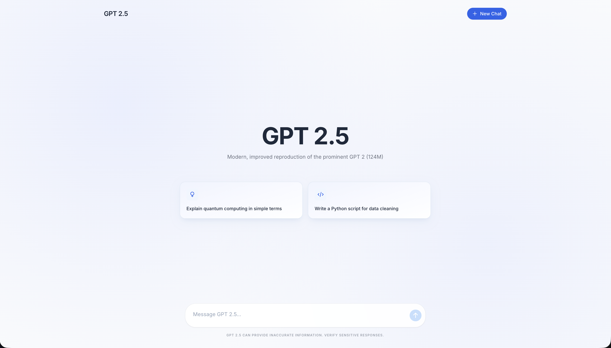
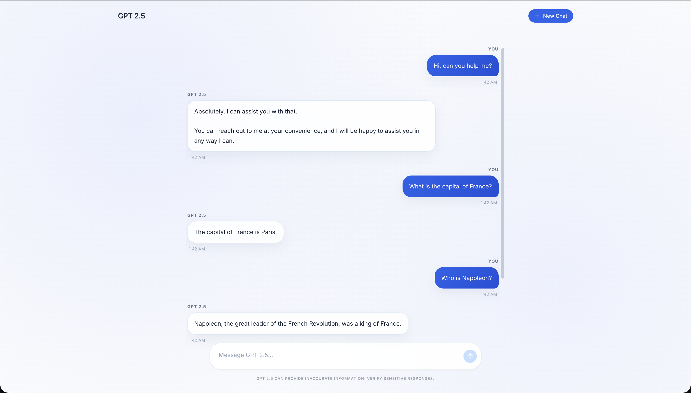
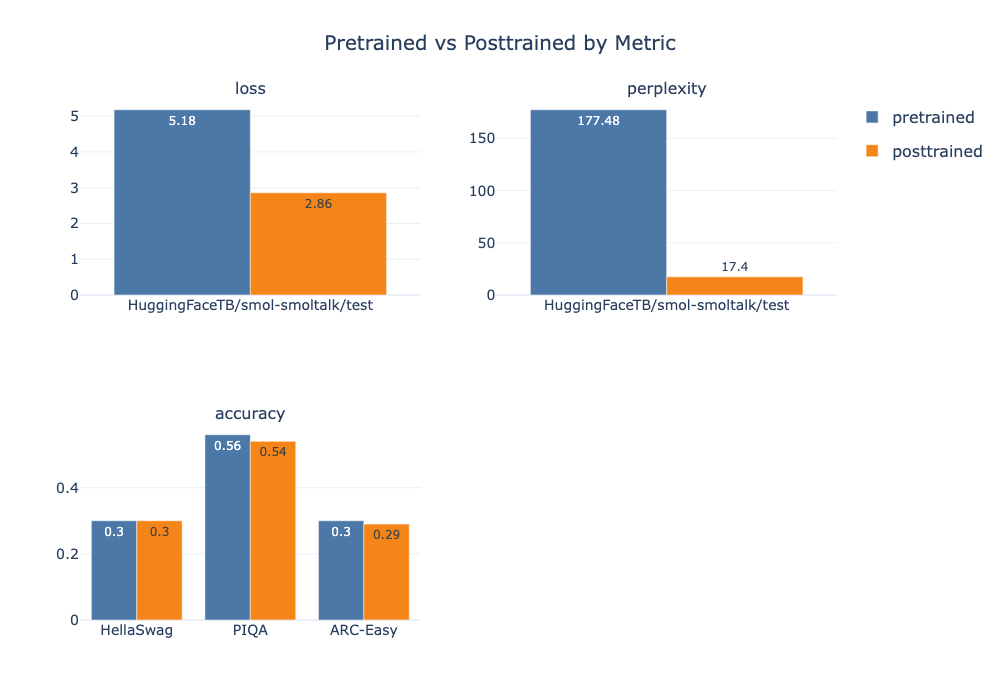
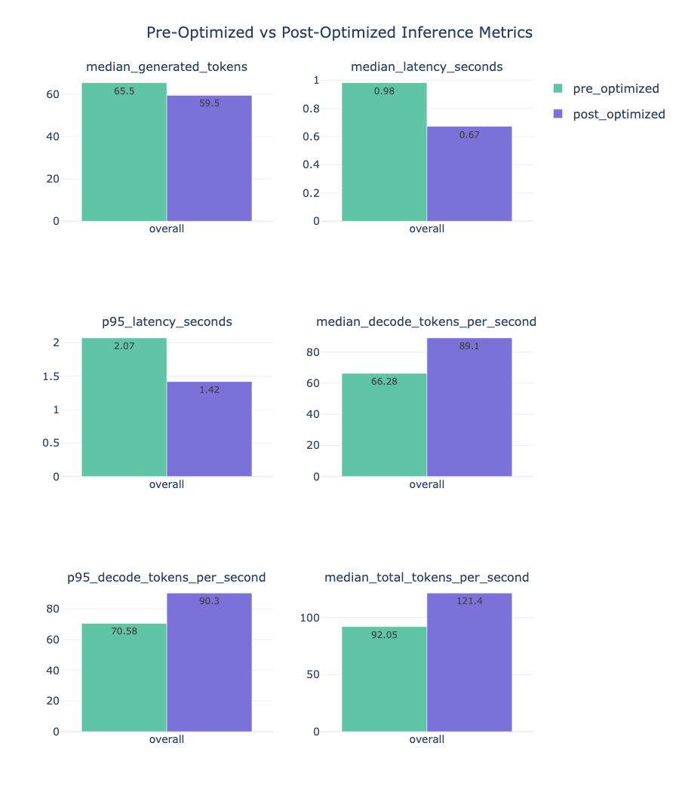

# 🚀 GPT-2.5 — Full 124M LLM Stack

A custom 124M GPT-style model stack that covers the full path from tokenizer work and base pretraining to instruction tuning, Hugging Face packaging, optimized inference, FastAPI serving, browser chat, and Docker deployment.

[](https://huggingface.co/itskoma)




## ✨ Highlights

- **End-to-end stack**: custom tokenizer code, base pretraining, post-training, HF-compatible packaging, optimized inference, API serving, SPA chat UI, and Docker.
- **Modern 124M architecture**: GPT-2 scale with RMSNorm, SwiGLU, RoPE, AdamW, bias-free linears, and SDPA/FlashAttention support.
- **Instruction tuning**: post-training recipe on `HuggingFaceTB/smol-smoltalk` for chat-style behavior.
- **Hugging Face runtime package**: `training/my_gpt_model` exposes custom `AutoConfig` / `AutoModelForCausalLM` loading for published checkpoints.
- **Serving stack**: `serving/app` ships a FastAPI app, browser chat UI, and inference runtime with optional `torch.compile`.
- **Benchmarking and optimization**: checked-in inference benchmark artifacts document the current latency, throughput, and memory improvements.


## 🔧 Modern Architectural Changes

| Feature             | Original GPT-2   | GPT-2.5 (This Repo) |
| :------------------ | :--------------- | :------------------ |
| **Normalization**   | LayerNorm (Post) | **RMSNorm (Pre)**   |
| **Activation**      | GELU             | **SwiGLU**          |
| **Positional Enc.** | Absolute         | **RoPE**            |
| **Attention**       | Standard         | **SDPA / Flash**    |
| **Optimizer**       | Adam             | **AdamW**           |
| **Bias in Linears** | Yes              | **No**              |
| **Dataset**         | WebText          | **FineWeb 10B**     |

## 🧱 Current Stack Capabilities

| Layer | Repo Path | What It Does |
| :---- | :-------- | :----------- |
| Tokenizer | `training/tokenizer/` | Custom BPE tokenizer implementation and training utilities |
| Base training | `training/pre_train/` | Distributed pretraining run for the 124M base model |
| Post-training | `training/post_train/` | Instruction tuning on `HuggingFaceTB/smol-smoltalk` plus local chat loop |
| HF packaging | `training/my_gpt_model/` | Remote-code-compatible package for `AutoConfig` / `AutoModelForCausalLM` |
| Serving | `serving/app/` | FastAPI API, inference runtime, static SPA assets |
| Benchmarks | `serving/benchmark_inference.py` | Startup and steady-state inference benchmarking CLI |
| Deployment | `Dockerfile` | GPU-ready serving image exposing port `8000` |


## 📦 Artifact Split

The repo now has two distinct artifact flows:

| Artifact | Default Repo | Role |
| :------- | :----------- | :--- |
| Dataset + checkpoints | `itskoma/GPT2.5` | FineWeb bins and the pretrained checkpoint used as the base for post-training, also includes port-training checkpoint |
| Served / chat model | `itskoma/MyGPT` | Default post-trained Hugging Face model loaded by `post_train.chat` and `serving/app` |

`training/my_gpt_model/` is the HF runtime package that makes the published model repos loadable with `trust_remote_code=True`.


## 🏋️ Pretraining

### Recipe

| Parameter | Value |
| :-------- | :---- |
| `batch_size` | `128` |
| `grad_accum_steps` | `1` |
| `context_length` | `1024` |
| `num_layers` | `12` |
| `num_heads` | `12` |
| `d_model` | `768` |
| `d_ff` | `2048` |
| `theta` | `10000` |
| `lr` | `6e-4` |
| `betas` | `(0.9, 0.95)` |
| `weight_decay` | `0.1` |
| `train_steps` | `20000` |
| `num_gpus` | `4` |

`tokens per step = 128 x 1 x 1024 x 4 = 524,288`

`actual training budget = 524,288 x 20,000 = 10,485,760,000 tokens (~10.49B)`

### Latest Run Metrics

| Metric | Score |
| :----- | :---- |
| `loss` | `3.1353` |
| `val_loss` | `3.3041` |
| `perplexity` | `22.9967` |
| `HellaSwag` | `0.3059` |


## 🧪 Post-Training

The instruction-tuning stage fine-tunes the pretrained base model on `HuggingFaceTB/smol-smoltalk` and installs the chat template / special tokens used by both the CLI chat loop and the serving stack.

### Recipe

| Parameter | Value |
| :-------- | :---- |
| Dataset | `HuggingFaceTB/smol-smoltalk` |
| `num_train_epochs` | `3` |
| `batch_size` | `8` |
| `context_length` | `1024` |
| `learning_rate` | `1e-5` |
| `packing` | `true` |
| `assistant_only_loss` | `true` |
| `weight_decay` | `0` |
| Precision | CUDA auto-selects `bf16` when supported, else `fp16` |

### Latest Run Metrics

| Metric | Score |
| :----- | :---- |
| `eval/loss` | `2.8575` |
| `eval/mean_token_accuracy` | `0.6508` |
| `train/loss` | `2.8244` |
| `train/global_step` | `30087` |

### Pre vs. Post Comparison



Observations:

- SmolSmoltalk loss and perplexity improve sharply after post-training.
- General-knowledge multiple-choice accuracy stays roughly flat to slightly down.


## ⚡ Inference Optimization

The serving runtime defaults to:

- on CUDA, inference uses `bf16` when available, otherwise `fp16`
- `sdpa` as the default attention backend
- optional `torch.compile(mode="max-autotune-no-cudagraphs")`

The checked-in benchmark artifacts compare a pre-optimization runtime against the current serving path. The main improvements are in steady-state decode behavior rather than cached startup time.



Inference optimization leads to:

-  About the same median generated tokens, lower p50 and p95 latency.
- Increase in p50 and p95 decoded tokens per second and median total tokens per second.


## 💬 Web App

The current product-facing surface is the served chat app: FastAPI mounts the SPA at `GET /`, static assets under `/static`, and chat inference at `POST /chat`.

<p align="center">
  
  
</p>


## 🛠️ Quickstart

This repo is split into two Python projects:

- `training/` for tokenizer work, pretraining, post-training, and HF model packaging
- `serving/` for the FastAPI app, browser UI, inference runtime, and benchmark CLI

### Training

Install the training environment:

```bash
uv sync --project training
```

Run the base pretraining entrypoint:

```bash
uv run --project training torchrun --nproc_per_node 4 -m pre_train.train \
  --batch_size 128 \
  --grad_accum_steps 1 \
  --context_length 1024 \
  --num_layers 12 \
  --d_model 768 \
  --num_heads 12 \
  --d_ff 2048 \
  --theta 10000 \
  --train_steps 20000 \
  --lr 6e-4 \
  --beta1 0.9 \
  --beta2 0.95 \
  --eps 1e-8 \
  --weight_decay 0.1
```

Run the post-training recipe with the code defaults:

```bash
uv run --project training python -m post_train.tune
```

Chat locally with the default served model repo (`itskoma/MyGPT`):

```bash
uv run --project training python -m post_train.chat
```

Notes:

- `pre_train.train` downloads `fineweb_train.bin` and `fineweb_test.bin` from `itskoma/GPT2.5`.
- `post_train.tune` starts from the base checkpoint flow rooted at `itskoma/GPT2.5`.
- Tokenizer code and local FineWeb preprocessing utilities live under `training/tokenizer/` and `training/data/src/`.

### Serving

Install the serving environment:

```bash
uv sync --project serving
```

Launch the FastAPI app and SPA:

```bash
uv run --project serving uvicorn app.main:app --host 0.0.0.0 --port 8000
```

Enable the optimized compiled path explicitly:

```bash
MODEL_REPO_ID=itskoma/MyGPT \
INFERENCE_USE_TORCH_COMPILE=1 \
INFERENCE_TORCH_COMPILE_MODE=max-autotune-no-cudagraphs \
INFERENCE_ATTENTION_BACKEND=sdpa \
uv run --project serving uvicorn app.main:app --host 0.0.0.0 --port 8000
```

Run the inference benchmark CLI from the repo root:

```bash
uv run --project serving python -m serving.benchmark_inference \
  --repo-id itskoma/MyGPT \
  --warmup-runs 3 \
  --runs 10 \
  --torch-compile \
  --output evals/local_inference_benchmarks.json
```


## 🐳 Docker

Build the serving image:

```bash
docker build -t gpt-2.5-serving .
```

Run the container with GPU exposure:

```bash
docker run --rm --gpus all -p 8000:8000
```

The container serves FastAPI on port `8000` and loads the Hugging Face model at startup.


## 📡 Operational Interfaces

### Entrypoints

| Surface | Interface | Purpose |
| :------ | :-------- | :------ |
| Training | `pre_train.train` | Base pretraining entrypoint |
| Training | `post_train.tune` | Instruction-tuning / post-training entrypoint |
| Training | `post_train.chat` | Local interactive chat loop |
| Serving | `app.main:app` | FastAPI ASGI app |
| Benchmarking | `serving.benchmark_inference` | Inference benchmark CLI module |

### HTTP

| Method | Path | Purpose |
| :----- | :--- | :------ |
| `GET` | `/` | Serve the SPA shell |
| `POST` | `/chat` | Run chat inference |


## 📜 License

This project is open-source. Feel free to use, modify, and distribute.
